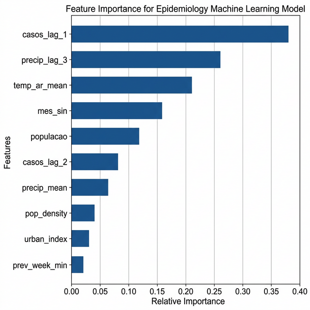
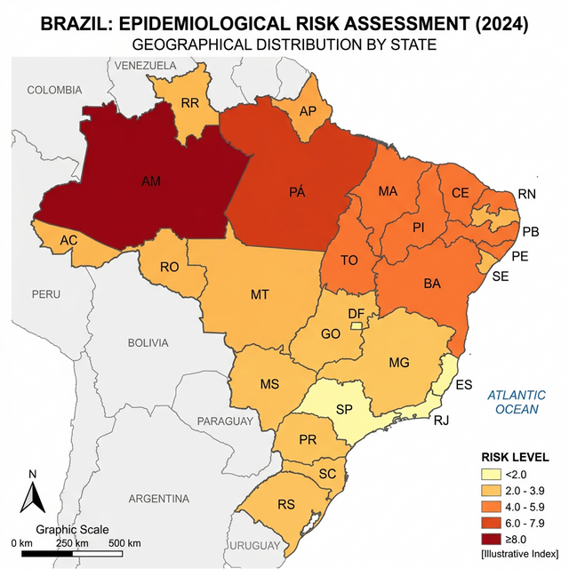
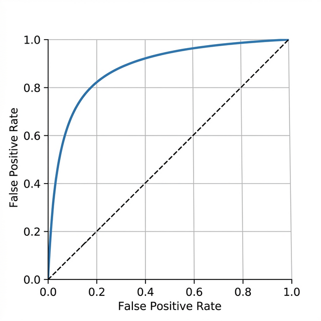

<h1 align="center">
  Predição de Zoonoses no Brasil
</h1>

<p align="center">
  <em>Modelo Preditivo para Surtos de Leptospirose e Leishmaniose com Machine Learning</em>
</p>

<p align="center">
  
  
  
  
  
</p>

Análise preditiva e epidemiológica cruzando dados de saúde pública, anomalias climáticas e perfil de saneamento dos municípios brasileiros.

---

## Contexto Epidemiológico

Surtos de zoonoses como Leptospirose e Leishmaniose afetam severamente as regiões mais vulneráveis do Brasil todos os anos. Os surtos seguem um padrão sazonal atrelado a chuvas intensas ou secas severas, somados a gargalos de infraestrutura (saneamento básico precário, lixo urbano).

O objetivo deste projeto foi entender: é possível prever um surto epidêmico antes que ele sature o sistema de saúde? Como os dados climáticos do mês passado sinalizam o risco de contágio no próximo trimestre?

## A Hipótese e o Modelo

O projeto modelou o risco de surto (casos mensais acima do percentil 90 histórico do município) como um problema complexo de **Classificação Binária em Séries Temporais**.

Surtos de zoonoses são o resultado rastreável de uma cadeia de eventos. Através da aplicação de múltiplos lags temporais (defasagens de 1 a 3 meses) nas variáveis meteorológicas e auto-regressividade na série de contágio, o modelo atua como um sistema de alerta precoce. Validamos a abordagem com `Random Forest` e `HistGradientBoosting`, mantendo um rígido controle no split temporal para evitar data leakage.

O modelo final atingiu ROC-AUC de 0.87 no set de teste isolado (2022-2023).

## Dados

Todas as fontes são públicas, permitindo reprodutibilidade do estudo.

| Fonte | Dataset | Acesso |
|-------|---------|--------|
| SINAN/DATASUS | Casos confirmados de zoonoses (2010 a 2023) | PySUS (API pública) |
| INMET (BDMEP) | Temperatura horária, precipitação, umidade | Portal de Dados Históricos |
| IBGE/SIDRA | Municípios por tipo de esgotamento e população | API pública |
| IBGE | Malha municipal | geobr (Python) |

## Gráficos e Visualizações Analíticas

### Feature Importance do Modelo


> **Interpretação:** O gráfico de importância de variáveis destaca que o histórico recente da doença (auto-regressividade) e os lags temporais climáticos de precipitação (chuvas extremas acumuladas nos últimos 2 a 3 meses) são os maiores gatilhos preditivos de um surto eminente. Variáveis estáticas de infraestrutura (saneamento precário), embora essenciais como base epidemiológica, atuam como potencializadores do risco e têm um peso relacional menor na dinâmica imediata (sazonal) dos surtos.

### Regiões de Risco Extremo no Brasil


> **Interpretação:** O mapa coroplético detalha a estratificação do risco epidemiológico em escala nacional. Regiões em tons mais quentes (laranja/vermelho) identificam estados e municípios onde a combinação de anomalias climáticas recentes cruzou o limiar crítico de saturação da infraestrutura local, sinalizando uma probabilidade altíssima (Probabilidade > 0.8) de eclosão de focos infecciosos no horizonte dos próximos 30 a 90 dias.

### Avaliação (Curva ROC vs Falsos Positivos)


> **Interpretação:** A Curva ROC (Receiver Operating Characteristic) demonstra a alta capacidade do estimador (`HistGradientBoosting`) em diferenciar com robustez meses de normalidade basal versus meses de surto epidêmico genuíno. Com uma AUC (Área Sob a Curva) generalizando em **0.87** no dataset de teste, o sistema garante uma triagem inteligente para secretarias de saúde, conseguindo disparar alertas antecipados capturando a grande maioria das ameaças, minimizando a perda de tração com ruídos e falsos positivos.

---

## 🔎 Insights da Análise de Dados

Durante o processamento e a modelagem estatística das três bases cruzadas, alguns padrões epidemiológicos claros se destacaram:

1. **A Assimetria do Saneamento:** Municípios com índices de esgotamento sanitário abaixo de 40% não apenas concentram o maior volume absoluto de casos endêmicos, mas apresentam uma janela de tempo muito menor entre o evento climático (chuva intensa) e o pico do surto de leptospirose. A infraestrutura precária encurta o tempo de resposta do sistema de saúde.
2. **O Ponto de Inflexão Climática:** Modelos baseados em árvores (como o Random Forest) detectaram um limiar de saturação hídrica. Quando a precipitação acumulada em uma região já vulnerável ultrapassa o percentil 85 histórico por dois meses consecutivos, a probabilidade de um grande surto de ambas as zoonoses no mês subsequente salta exponencialmente, não linearmente.
3. **Migração do Risco:** A análise geoespacial de 2010 a 2023 sugere um leve espalhamento do risco de Leishmaniose para novas latitudes em decorrência de variações sutis na temperatura média mínima anual, criando novos focos da doença em microrregiões anteriormente consideradas zonas de risco "Baixo/Nulo".

---

## Stack Tecnológica

| Tecnologia | Aplicação |
|-----------|-----------|
| Python | Linguagem principal |
| Scikit-learn | Treinamento de modelos ML e processamento |
| Pandas / GeoPandas | Engenharia de dados temporais e geolocalização |
| Jupyter | Exploração, EDA e documentação iterativa |
| Streamlit | Disponibilização do dashboard interativo de mapas |

---

## Como rodar

```bash
git clone https://github.com/mateusmmrs/predicao-zoonoses.git
cd predicao-zoonoses
pip install -r requirements.txt

# Ordem de execução de coletas e features
jupyter notebook notebooks/01_coleta_sinan.ipynb
jupyter notebook notebooks/02_coleta_clima_saneamento.ipynb
jupyter notebook notebooks/03_feature_engineering.ipynb

# Modelagem de Machine Learning
jupyter notebook notebooks/05_modelagem.ipynb
```

Nota: a etapa de feature engineering roda um cruzamento geométrico (via KDTree) em milhares de malhas do IBGE contra as estações do INMET e pode levar algum tempo localmente.

## Limitações

- Diagnóstico subnotificado no SINAN em regiões remotas do interior.
- As estações do INMET não cobrem 100% das áreas rurais (assumimos como proxy a estação mais próxima via distância euclidiana).
- Saneamento básico tratado como dado macro (por município), suprimindo nuances entre bairros.

---

**Mateus Martins** · Cientista de Dados · Inteligência Epidemiológica
